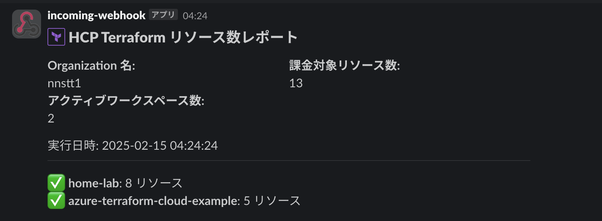

# HCPt resource counter

HCP Terraform の RUM (Resource Under Management) 数をカウントして Slack に投稿するツールです。



実行環境に Azure Functions を使っています。
Azure Developer CLI (azd) を使って環境構築できます。

## 必要なもの

- 投稿先 Slack チャンネルの Incoming Webhook 設定
- HCP Terraform 用トークン
  - アカウントトークン or Organization トークン
- Azure Functions
  - Timer トリガーを使う場合は環境変数を設定

| 環境変数 | 値 |
| --- | --- |
| SLACK_WEBHOOK | 投稿先 Slack チャンネルの Incoming Webhook URL |
| TF_ORGANIZATION | HCP Terraform の Organization 名 |
| TF_TOKEN | HCP Terraform トークン |

## トリガー

- [Timer](https://learn.microsoft.com/ja-jp/azure/azure-functions/functions-bindings-timer)
  - 指定時刻に起動して Slack に投稿するトリガー
- HTTP
  - GET
    - HCP Terraform の RUM 数を応答するトリガー
  - POST
    - HCP Terraform の RUM 数を Slack に投稿するトリガー

### Timer

指定時刻で Slack チャンネルに HCP Terraform の RUM 数を投稿します。

起動時刻は `function_app.py` 内の `timer_trigger` に指定します。
投稿先の Slack チャンネル、HCP Terraform の Organization は Azure Functions の環境変数を参照します。

### HTTP トリガー - GET

クエリパラメータ、または Azure Functions の環境変数で指定された HCP Terraform の RUM 数を応答します。

HTTP トリガーのエンドポイントを表示します。

```bash
export APP_NAME=$(azd env get-value AZURE_FUNCTION_NAME)
func azure functionapp list-functions $APP_NAME --show-keys
```

| パラメータ | 値 |
| --- | --- |
| org | HCP Terrafrom の Organization 名 |
| token | HCP Terrafrom トークン |

```bash
$ curl "https://<HTTP_GET_URL>"
{
  "organization": "nnstt1",
  "total_resources": 13,
  "active_workspaces": 2,
  "timestamp": "2025-02-15 04:24:24",
  "workspaces": [
    {
      "name": "home-lab",
      "count": 8,
      "status": "active"
    },
    {
      "name": "azure-terraform-cloud-example",
      "count": 5,
      "status": "active"
    }
  ]
}
```

### HTTP トリガー - POST

HCP Terraform の RUM 数を Slack チャンネルに投稿します。
各パラメータはリクエストボディ、または Azure Functions の環境変数で指定します。

| パラメータ | 値 |
| --- | --- |
| slack_webhook | 投稿先 Slack チャンネルの Incoming Webhook URL |
| org | HCP Terrafrom の Organization 名 |
| token | HCP Terrafrom トークン |

```bash
$ curl -X POST "https://<HTTP_POST_URL>" -H "Content-Type: application/json" -d '{"slack_webhook": "<SLACK_WEBHOOK>"}'
{
  "organization": "nnstt1",
  "total_resources": 13,
  "active_workspaces": 2,
  "timestamp": "2025-02-15 04:24:24",
  "workspaces": [
    {
      "name": "home-lab",
      "count": 8,
      "status": "active"
    },
    {
      "name": "azure-terraform-cloud-example",
      "count": 5,
      "status": "active"
    }
  ]
}
```

## Azure Developer CLI による環境構築

このツールは Azure Developer CLI の [functions-quickstart-python-http-azd](https://github.com/Azure-Samples/functions-quickstart-python-http-azd) テンプレートを使って実行環境を構築できます。

作成される Azure Functions は [Flex Consumption プラン](https://learn.microsoft.com/ja-jp/azure/azure-functions/flex-consumption-plan)です。
日本リージョンに構築できない（2025 年 2 月時点）などの Flex Consumption プラン特有の制約があります。

`azd` を使って Azure リソースを作成します。

```shell
azd up
```

VNet を作成しない場合は `SKIP_VNET` に `true` を設定します。
この場合、`azd up` で作成されるストレージアカウントはパブリックアクセス可能な設定となります。

```bash
azd env set SKIP_VNET true
azd up
```

Azure リソース作成後、Azure Functions に関数をデプロイできます。

```bash
azd deploy
```
